# Отчет о разработке модели предсказания вероятности дефолта заемщика ФЛ

# Введение

Эффективное управление кредитными рисками является одной из первостепенных задач для финансовых институтов в условиях современной экономики. Неспособность заемщика исполнить свои долговые обязательства (дефолт) ведет к прямым финансовым потерям, увеличению резервов и повышению стоимости фондирования. В этой связи создание надежных и точных моделей для оценки кредитоспособности клиентов становится критически важным элементом системы риск-менеджмента.

Основная задача такого моделирования заключается в прогнозировании вероятности наступления дефолта (Probability of Default, PD) для каждого заемщика на основе совокупности его характеристик. Точная оценка PD позволяет сегментировать клиентов по уровню риска, принимать обоснованные решения о выдаче кредита, определять его условия (ставку, лимит) и в конечном итоге -- оптимизировать кредитный портфель в целом.

Целью данной работы является разработка модели для прогнозирования вероятности дефолта заемщика.

## Данные

Для построения модели были использованы следующие источники:

1. Данные о выдаче (applications)
2. Данные о предыдущих выдачах (previous applications)
3. Данные о платежах (installments)
4. Данные БКИ (bureau)

В тренировочном наборе данных 307511 наблюдений, в тестовом наборе 48744 наблюдений. Признаковое пространство содержит 502 фичи.

Для определения консистентности тренировочного и тестового набора данных был проведен [classifier two sample test](https://arxiv.org/pdf/1610.06545). По итогам теста было выявлено значимое расхождение в распределении фичей между наборами данных (ROC-AUC ~0.8). Обобщая, можно заключить, что в тренировочном наборе данных некоторые признаки имеют более длинные правые хвосты.
На основании скоров модели (cut-off point 0.6) была сформирована out-of-sample выборка.

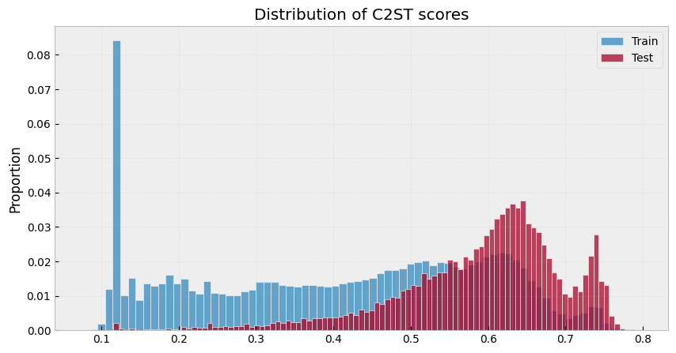

Доля дефолтов в получившихся выборках:

| Sample | Default Rate |
| ------ | ------------ |
| Glob   | 0.0807       |
| Train  | 0.0805       |
| OOS    | 0.0815       |

По итогам исследовательского анализа была проведена дополнительная предобработка данных, перечень манипуляций указан в блоке data_preprocessing.py.
Одна из имеющихся проблем - наличие пропущенных значений, было принято решение не использовать классические методы импьютации, чтобы не вносить дополнительное смещение. Пропущенные значения обрабатывались автоматически моделью бустинга.

## Методология

Для валидации модели помимо OOS выборки использовалась кросс-валидация (StratifiedKFold) с 5 фолдами.

Первым этапом построения модели стало формирование short list-а фичей. Для отбора признаков использовалась модель LGBMClassifier, параметры модели указаны в feature_selection.ipynb.
Из 501 фичи методом рекурсивной элиминации по feature importance был сформирован список из 99 фичей на основании CV и OOS оценок.

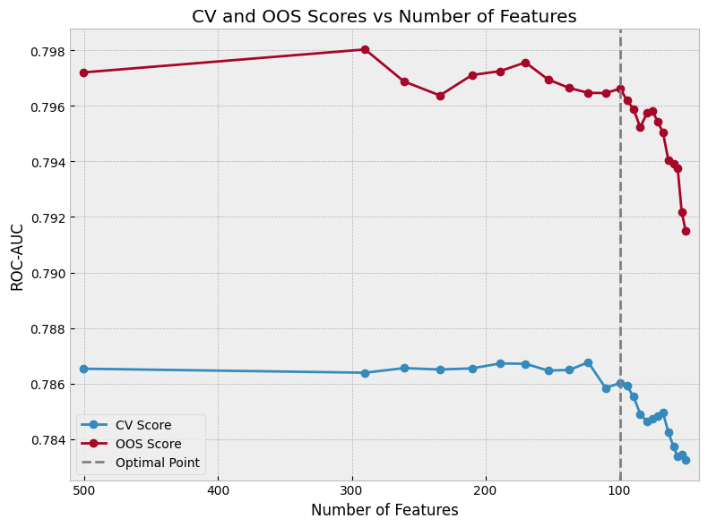

Далее, методом рекурсивной элиминации по permutation score был сформирован short list из 64 фичей на основании CV и OOS оценок.

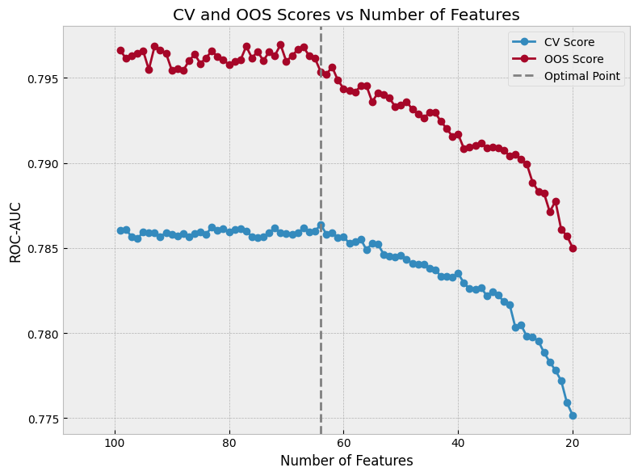

Следующим этапом стал отбор оптимальных гиперпараметров. Отбор осуществлялся через библиотеку optuna. Оптимальные параметры

```json
{'n_estimators': 540, 'num_leaves': 27, 'min_child_samples': 1857, 'colsample_bytree': 0.5002287019819426, 'reg_alpha': 0.019998333098629646, 'reg_lambda': 2.6663467952723607e-06}
```

На основании кривых обучения, построенных по данным TRAIN и OOS выборок, было также подобрано более консервативное, для предотвращения переобучения, значение n_estimators.

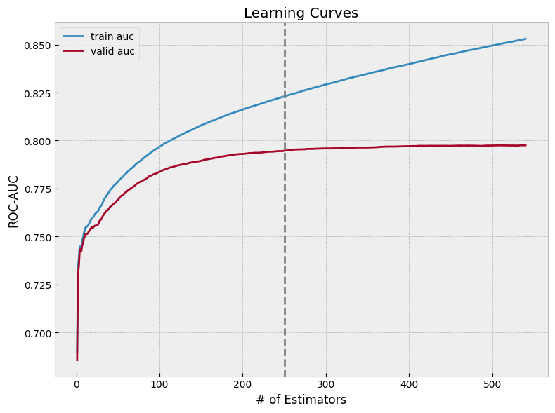

## Результаты

Для удобной оценки результатов модели был разработан пользовательский класс ModelTrainer.

Итоговая модель достигла значения 78.5% и 79.5% ROC-AUC и 27.7% и 28% PR-AUC на OOF и OOS выборках соотвественно.

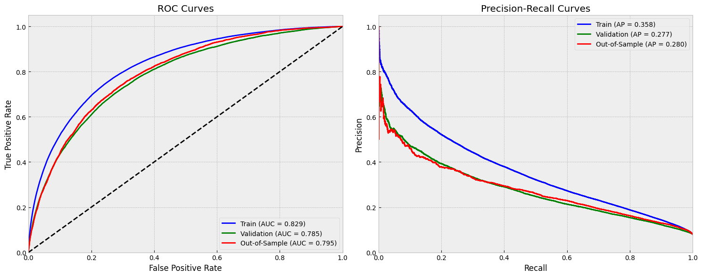

Список 15 наиболее важных признаков

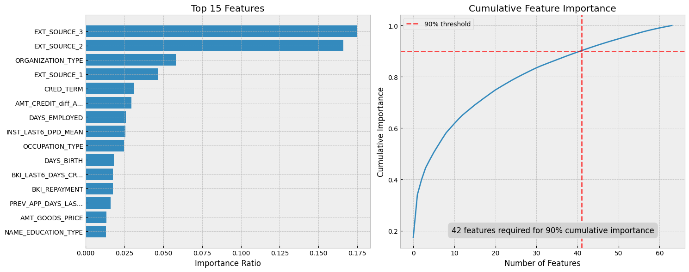

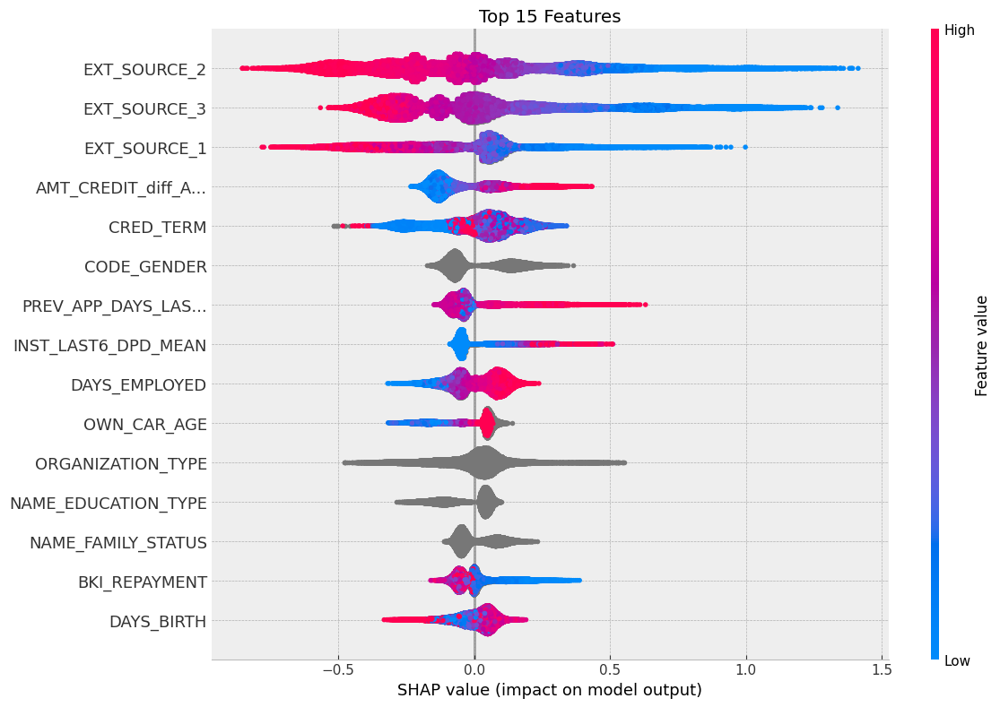

Предсказания модели также были проверены на достоверность. По итогам проверки, модель не нуждается в дополнительной калибровке предсказываемых вероятностей.

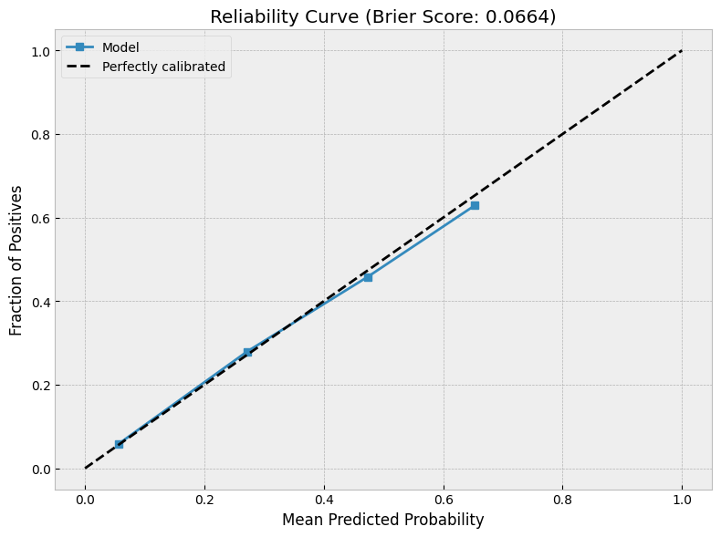

Условное распределение модельного PD

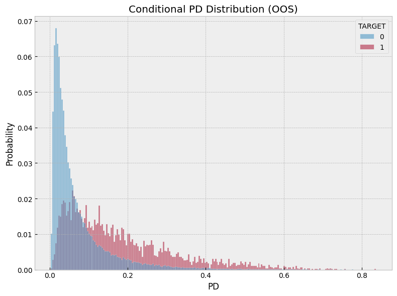

Методом бутстрапа (разница в средних) было замерено попадание модельной оценки PD в 95% и 99% доверительные интервалы.

| Sample | Observed Diff |  CI Lower |  CI Upper | Significant | CI Level |
| :----- | ------------: | --------: | --------: | :---------- | -------: |
| Glob   |     -0.000468 | -0.001463 |  0.000534 | False       |       95 |
| OOS    |       -0.0026 | -0.004994 | -0.000218 | True        |       95 |
| Glob   |     -0.000468 | -0.001773 |   0.00089 | False       |       99 |
| OOS    |       -0.0026 | -0.005796 |  0.000621 | False       |       99 |

Попадение модельной оценки в 99% доверительный интервал было также замеренно в срезах относительного возраста клинта и срочности кредита на OOS выборке.

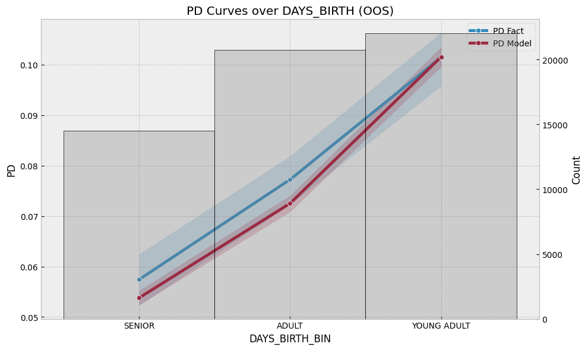

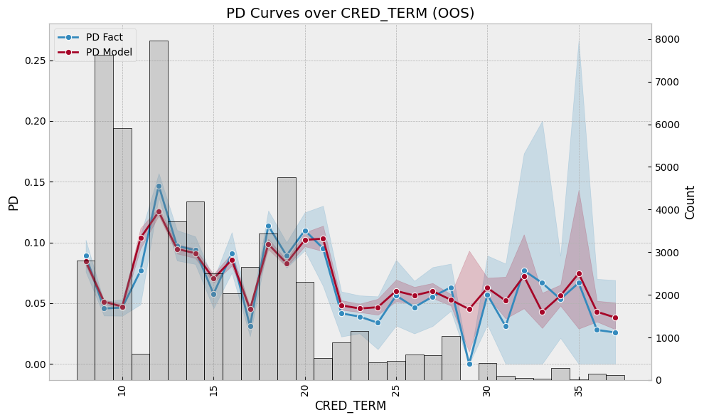
